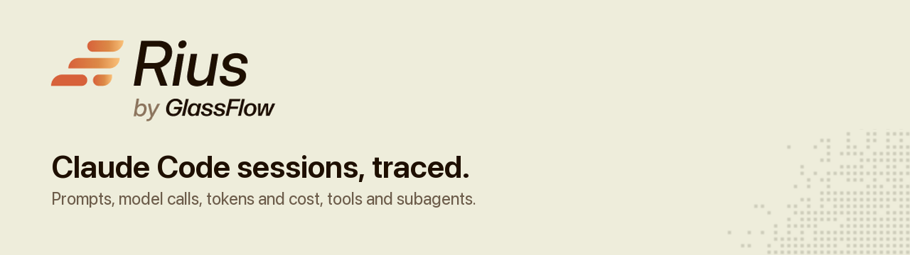
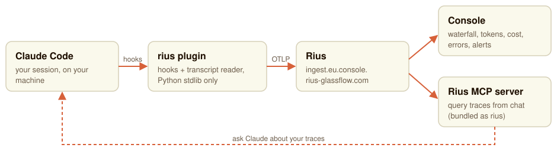

<p align="center">
  
</p>

# Rius for Claude Code

A Claude Code plugin that streams your sessions to [Rius](https://www.glassflow.ai/rius)
as OpenTelemetry GenAI traces. Each session becomes one trace: turns, model
generations with token counts, tool calls and subagents, laid out as a
waterfall that fills in while the session is still running.

<p>
  <a href="https://docs.glassflow.ai/rius"><b>Docs</b></a> ·
  <a href="https://console.rius-glassflow.com">Console</a> ·
  <a href="docs/getting-started.md">Getting started</a> ·
  <a href="CHANGELOG.md">Changelog</a> ·
  <a href="https://github.com/glassflow/rius-coding-agents/issues">Issues</a>
</p>

[](https://github.com/glassflow/rius-coding-agents/actions/workflows/ci.yml)
[](LICENSE)


<!-- SCREENSHOT SLOT: a Claude Code session's waterfall in the Rius console,
     captured on production with the workspace name masked. Save it as
     docs/assets/console-trace.png and replace this comment with:
      -->

## What gets sent -- read this before enabling anything

By default this plugin captures **full session content**: every user prompt,
every assistant message, every tool input, and every tool **output**. Tool
output means the actual contents of files Claude Code read and the actual
output of commands it ran. If a session happens to `cat` a `.env` file or read
a config with a credential in it, that content is captured and sent to your
Rius workspace like any other tool output.

Two things bound this:

1. **Tracing is off by default.** Nothing is sent for any folder until you
   explicitly enable it (see [Enabling a folder](#enabling-a-folder) below).
   Installing the plugin does not, by itself, upload anything.
2. **`RIUS_CAPTURE_CONTENT=false`** turns off content capture entirely, for
   every folder you've enabled. You still get full structure: span
   hierarchy, model names, token counts (including cache reads), cost, timing
   and status. You lose prompt text, assistant text, and tool input/output
   values.

Only enable a folder you're comfortable having its file reads and command
output leave the machine, or set `RIUS_CAPTURE_CONTENT=false` first.

## Quick start

```
/plugin marketplace add glassflow/rius-coding-agents
/plugin install rius@rius-coding-agents
/rius:login
/rius:enable-here
/rius:status
```

`/rius:login` opens the Rius console (`https://console.rius-glassflow.com`)
in the browser, where you sign in or sign up and pick the workspace this
machine sends to; the plugin stores a key for it. That is the whole flow.
If `/rius:status` doesn't say `on`, the
[getting started guide](docs/getting-started.md) covers the rest end to end:
workspace, key and scopes, endpoints, staging, first trace, the Rius MCP
server, and troubleshooting.

To update later, refresh the marketplace, because Claude Code caches it:

```
/plugin marketplace update rius-coding-agents
/reload-plugins
```

Runs on macOS, Linux and Windows (through Git Bash) with any Python 3.9+ on
`PATH`. [Installing and updating](docs/install.md) covers the upgrade from the
old `rius-claude-code` name, working from a local checkout, and platform
details.

## What you see in Rius

- **One trace per session.** Session, then turn, then model generation, then
  tool call. Subagents nest under the tool call that started them, with
  their own generations and tools.
- **Tokens and cost per generation**, including cache reads, with the model
  that produced them.
- **Live sessions.** Spans appear as they start, and a 15-second heartbeat
  keeps a long turn from reading as dead. A session that crashes mid-run
  stays visibly unfinished.
- **Failed tool calls marked as errors**, with the output that explains why.
- **Your traces from inside Claude Code**, through the bundled Rius MCP server.

<picture>
  <source media="(prefers-color-scheme: dark)" srcset="docs/assets/how-it-works-dark.svg">
  
</picture>

[How it works](docs/how-it-works.md) has the span tree, how subagents are
followed, the heartbeat, and why generation durations run long.

## Enabling a folder

Tracing defaults to off everywhere. To turn it on for the folder you're
currently in:

```
/rius:enable-here
```

This adds your current working directory to the path rules stored in
`~/.claude/rius/config.json`. Every subdirectory under it is enabled too. The
default-off behavior exists so that installing the plugin can never silently
start uploading a repo nobody has thought about -- see
[What gets sent](#what-gets-sent----read-this-before-enabling-anything).

You also need a key: `/rius:login`, or `RIUS_API_KEY` (see
[Settings](#settings)). Without one, tracing stays off regardless of any
other setting.

## `/rius:*` commands

| Command | Effect |
|---|---|
| `/rius:login` | Sign in in the browser, pick the workspace this machine sends to, and store a key for it. Production by default; `/rius:login --env staging` for staging. |
| `/rius:enable-here` | Add the current working directory to the persistent path rules. This is the normal way to turn tracing on. |
| `/rius:disable-here` | Stop tracing the current working directory and everything under it. A disabled folder beats any enabled parent. |
| `/rius:status` | Print the resolved on/off state, the rule that decided it, the signed-in account, the endpoint, the redacted API key, spans exported so far, and the last export error if there was one. |
| `/rius:logout` | Revoke the stored key on the server, then delete it locally. |
| `/rius:on` | Turn tracing on for this session only, overriding path rules and env vars. |
| `/rius:off` | Turn tracing off for this session only, same override strength as `on`. |

`/rius:on` and `/rius:off` pass the current session id themselves. Run from a
shell, `rius_ctl.sh on|off|clear` refuse to run without an explicit
`--session <id>`: inferring it from the most recently active session would
either do nothing useful on a fresh install or flip tracing for a different
session you happen to have open. Most of the time you want
`/rius:enable-here` instead, which is persistent and needs no session id.

Any other action prints its usage line and exits 0. Every command passes
`--cwd` for you, so `enable-here`, `disable-here` and `status` always see the
folder you are actually in.

`/rius:status` is the important one. Because the default is off, a plugin
that's installed correctly but simply not enabled for this folder looks
identical, from the outside, to a plugin that's broken. `status` disambiguates
by printing not just on/off but **which layer decided it** -- for example:

```
Rius tracing: off
Reason: off: no path rule matches /Users/you/some/repo, and the default is off
```

versus

```
Rius tracing: off
Reason: off: RIUS_API_KEY is not set
```

Those are different problems (folder not enabled vs. missing key), and the
`Reason` line is what tells you which one you have.

`status` also prints the platform implementation that is live, the endpoint,
`Spans exported this session`, and -- whenever an export has failed -- a
`Last export error` line carrying the reason and the time. The
[troubleshooting section](docs/getting-started.md#troubleshooting) of the
getting started guide maps those reasons onto fixes, along with the
`~/.claude/rius/log/` files to read when `status` itself is not enough.

## Settings

All settings are environment variables, read from the environment Claude Code
passes to hook processes (which includes values from `~/.claude/settings.json`
and project `.claude/settings.json`/`settings.local.json`).

| Variable | Default | Meaning |
|---|---|---|
| `RIUS_API_KEY` | unset | Wins over the key `/rius:login` stored, for tracing. With neither, tracing is disabled regardless of every other setting. The bundled MCP server never sees it: Claude Code withholds credential-named variables from a plugin's `headersHelper`. |
| `RIUS_ENDPOINT` | `https://ingest.eu.console.rius-glassflow.com` | Base URL only, no path. The plugin appends `/v1/traces` and `/v1/heartbeat` itself. A key from `/rius:login` brings its own. |
| `RIUS_ENV` | `production` | The environment `/rius:login` signs in to: `production` or `staging`. `--env` wins over it. |
| `RIUS_MCP_URL` | `https://mcp.eu.console.rius-glassflow.com/mcp` | The bundled MCP server's URL. Set it for a staging key; `/rius:status` says when it does not match the stored key. |
| `RIUS_SERVICE_NAME` | `claude-code` | Sets the `service.name` resource attribute. |
| `RIUS_CLAUDE_ENABLED` | unset | Per-folder on/off override, normally set via `.claude/settings.json` or `settings.local.json` rather than by hand. |
| `RIUS_CAPTURE_CONTENT` | `true` | `false` drops prompt/message/tool-input/tool-output content, including a subagent's brief and description and a failed tool's output (its status reads `tool error (detail withheld: RIUS_CAPTURE_CONTENT=false)`); structure, models, tokens, cost, and timing are kept either way. |
| `RIUS_CLAUDE_MAX_ATTR_BYTES` | `32768` | Per-value truncation cap for content attributes, so a large file read doesn't break the export. Truncated values carry an explicit `…[truncated N bytes]` marker. |
| `RIUS_CLAUDE_DEBUG` | `false` | Verbose logging to `~/.claude/rius/log/`, including the detached exporter's and heartbeat pinger's own stderr (`spawn.log`). |

Unhandled exceptions are written to `~/.claude/rius/log/` **regardless of
`RIUS_CLAUDE_DEBUG`**. This is deliberate. Every hook exits 0 and the exporter
swallows its exceptions by design, so a crash that left no trace would be
invisible to everyone, forever; a log line is the only thing that isn't.
Normal operation writes nothing there unless debug is on.

Resolution order (first decision wins): a per-session `/rius:on`/`/rius:off`
override, then `RIUS_CLAUDE_ENABLED` from the environment, then the path rules
in `~/.claude/rius/config.json`, then the global default of off. If
`RIUS_API_KEY` is unset, tracing is forced off no matter what the above
resolves to.

## Your own API key

`/rius:login` is all most people need. To mint a key in the console instead,
or to decide where a hand-minted key should live, see
[API keys](docs/api-keys.md).

## Asking Claude about your traces

The plugin bundles the Rius MCP server as `rius`, so you can query the
traces it produces from inside Claude Code. It uses the key `/rius:login`
stored (through a `headersHelper`, so the key never lands in an MCP config;
`RIUS_API_KEY` never reaches it, because Claude Code withholds
credential-named variables from a plugin's helper) and
connects to `https://mcp.eu.console.rius-glassflow.com/mcp`. After
`/rius:login`, reconnect `rius` in `/mcp` or restart Claude Code.

A staging key needs `RIUS_MCP_URL` pointed at the staging MCP host before
Claude Code starts: `.mcp.json` can only expand environment variables, so
the plugin cannot follow the stored key there by itself. `/rius:login` and
`/rius:status` print the exact setting when it is needed.

The server needs a `read`-scoped key; a hand-minted ingest-only key is
rejected with a 403. With it connected, questions like "which of my sessions
in the last 24 hours cost the most, and what did the tokens go on?" or "show
the waterfall for my last errored trace and say which tool call failed" are
answerable in chat. The
[getting started guide](docs/getting-started.md#exploring-your-traces-from-claude-code)
lists the main tools and how to register the server without the plugin.

## Beyond Claude Code

Rius traces other agents as well. The
[Python and TypeScript SDKs](https://docs.glassflow.ai/rius/sdk/installation)
have integrations for the
[Claude Agent SDK](https://docs.glassflow.ai/rius/sdk/integrations/claude-agent-sdk),
the [OpenAI Agents SDK](https://docs.glassflow.ai/rius/sdk/integrations/openai-agents),
[LangChain](https://docs.glassflow.ai/rius/sdk/integrations/langchain),
[CrewAI](https://docs.glassflow.ai/rius/sdk/integrations/crewai),
[Pydantic AI](https://docs.glassflow.ai/rius/sdk/integrations/pydantic-ai)
and more. Anything that already emits OpenTelemetry, whether through
[OpenLLMetry](https://docs.glassflow.ai/rius/interoperability/openllmetry),
[OpenInference](https://docs.glassflow.ai/rius/interoperability/openinference),
a plain [OTel SDK](https://docs.glassflow.ai/rius/interoperability/otel-sdks)
or a [Collector](https://docs.glassflow.ai/rius/interoperability/collector),
can send to Rius without code changes.

## Privacy and security posture

- Zero runtime dependencies: the plugin is Python standard library only,
  nothing is pulled from PyPI at install or run time.
- Span exports go only to the configured `RIUS_ENDPOINT` (or the endpoint
  stored with the `/rius:login` key). `/rius:login`, `/rius:logout` and a
  re-login's revoke of the previous key also call the sign-in host
  (`connect.console.rius-glassflow.com`, or
  `connect.staging.rius.glassflow.xyz` on staging), and the bundled MCP
  server talks to `RIUS_MCP_URL` when you use it. Nothing else is
  contacted.
- The API key is never logged. `/rius:status` and debug logs print it
  redacted (prefix plus an ellipsis).

## Uninstall

```
/plugin uninstall rius
```

Local state -- session overrides, path rules, per-session span-count state,
and debug logs -- lives entirely under `~/.claude/rius/` and is not removed
by uninstalling the plugin. Delete that directory by hand if you want a clean
slate:

```
rm -rf ~/.claude/rius/
```

## Documentation

| Page | What it covers |
|---|---|
| [Getting started](docs/getting-started.md) | Workspace, key and scopes, endpoints, staging, first trace, MCP, troubleshooting |
| [Installing and updating](docs/install.md) | Marketplace cache, upgrading from `rius-claude-code`, local checkout, platforms |
| [How it works](docs/how-it-works.md) | The span tree, subagents, live spans, generation timing, heartbeat |
| [API keys](docs/api-keys.md) | Minting a key by hand and where to keep it |
| [Design records](docs/design/) | The original spec, plan and build log |
| [Changelog](CHANGELOG.md) | What changed in each version |
| [Rius docs](https://docs.glassflow.ai/rius) | The product: console, alerts, MCP tools, SDKs |

## Contributing

Bug reports and pull requests are welcome. The plugin is standard-library
Python and the suite runs with:

```
python -m pip install 'pytest>=7.0' 'opentelemetry-proto==1.43.0'
python -m pytest -q
claude plugin validate .
```

`opentelemetry-proto` is test-only: it checks the hand-written OTLP encoder
against the real wire format and never ships.

## License

[MIT](LICENSE). Built by [GlassFlow](https://www.glassflow.ai).
